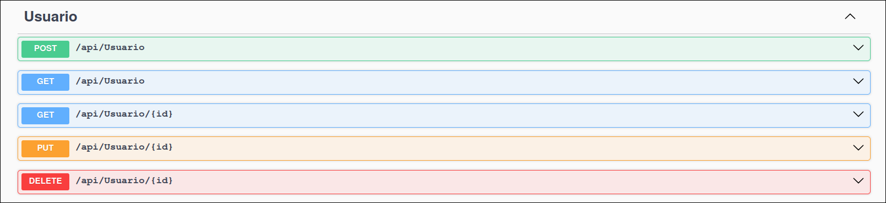
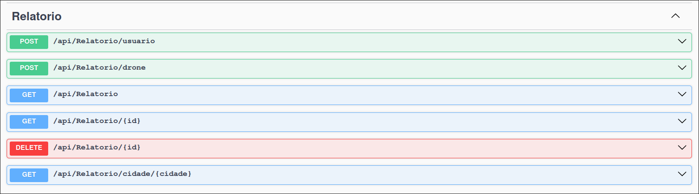

# GS - Protech The Future | .NET

## Integrantes

| Nome                   |   RM   |
| :--------------------- | :----: |
| Otavio Miklos Nogueira | 554513 |
| Luciayla Yumi Kawakami | 557987 |

---

## Links

- Repositório: https://github.com/omininola/gs_dotnet
- Vídeo demonstrativo: https://youtu.be/6VcB2TAVKsY
- Vídeo Pitch: https://youtu.be/Sd4V2oEn3bM

---

## Projeto

A solução foi pensada para ser uma forma simples e efetiva de alertar as pessoas sobre incêndios e queimadas em suas regiões, a nossa API tem diversos endpoints que possibilitam a troca de informação entre o banco de dados e as comunidades, já que cada usuário pode relatar algum incêndio ou queimada que avistaram pela própria região, gerando assim um senso de alerta maior, e uma cooperação para a identificação desses problemas.

Além disso, também temos drones equipados com sensores e camêras capazes de identificar esses desastres e alertar também as suas regiões, deixando esse processo mais automático e eficiente.

---

## Diagramas


---

## Desenvolvimento

A solução é composta por uma Web API e um projeto MVC ambos feitos utilizando:
- ASP.NET Core 9.0
- Microsoft.EntityFrameworkCore
- MySql.EntityFrameworkCore

A API também utiliza esses pacotes para a documentação:
- OpenApi
- Swashbuckle

### Camadas

#### Web API

- Controllers: Representam a porta de entrada para os nossos endpoints
- DTO (Data Transfer Object): Separam de uma forma mais organizada os nossos objetos do banco e os nossos objetos utilizados na API, como Requests e Responses
- Models: São um espelho do que vai ser guardado no banco de dados, aqui são feitas os relacionamentos entre as entidades
- Data: Aloca a instância de referência para o nosso banco e informa as tabelas que devem ser geradas

#### Projeto MVC

- Controllers: É onde a lógica da nossa aplicação se encontra
- DTO (Data Transfer Object): Separam de uma forma mais organizada os nossos objetos do banco e os nossos objetos utilizados na API, como Requests e Responses
- Models: São um espelho do que vai ser guardado no banco de dados, aqui são feitas os relacionamentos entre as entidades
- Views: Representa a parte vísivel do app, feita utilizando Razor & TagHelpers
- Data: Aloca a instância de referência para o nosso banco e informa as tabelas que devem ser geradas

---

## Inicialização

Clone esse repositório com o comando `git clone https://github.com/omininola/gs_dotnet.git`

Como o server foi feito utilizando MySQL, é necessário ter o Docker instalado ná máquina
- Link: https://docs.docker.com/desktop/setup/install/windows-install/

Caso já tenha o Docker, certifique-se de que o Docker Desktop ou Docker Engine estejam rodando

Incialize o container MySQL:
```bash
docker run \
    --detach \
    --publish 3306:3306 \
    --name gs_mysql \
    --network gs_network \
    --volume gs_volume:/var/lib/mysql \
    --env MYSQL_USER=user \
    --env MYSQL_PASSWORD=StrongPassword \
    --env MYSQL_DATABASE=GS_DOTNET \
    --env MYSQL_ROOT_PASSWORD=root123 \
    mysql:latest
```

*Container do banco serve tanto para a API quanto pro MVC*

### API

Para o funcionamento correto será necessário *buildar a API com Docker*

1. Entre na pasta do projeto `cd gs_dotnet`
2. Rode o comando `docker build . -t gs_dotnet`
3. Rode o container:
```bash
docker run \
    --detach \
    --publish 8080:8080 \
    --name gs_api \
    --env DB_PASSWORD=StrongPassword \
    --network gs_network \
    gs_dotnet
```
1. Entre no link da aplicação pelo seu browser http://localhost:8080/swagger/index.html

### MVC (Somente referente a tabela de usuários)

1. Entre na pasta do projeto `cd gs_dotnet/NaturalDisasterMVC`
2. Rode o MVC `dotnet run`
3. Entre no link da aplicação pelo seu browser http://localhost:5010/

---

### Testes

Você pode importar os endpoints no Postman usando o arquivo
- [endpoints.json](./docs/endpoints.json)

Ou importar diretamente da aplicação, com o app rodando:
1. Vá para a url: http://localhost:8080/swagger/v1/swagger.json
2. Copie o json recebido
3. Abra o Postman, ou seu app preferido de teste de endpoints
4. Importe o json copiado
5. Cetifique-se de que a base url aponta para http://localhost:8080

---

### Exemplos

Nossa API disponibilza diversos endpoints para uma melhor experiência. Os principais deles são /usuario juntamente com /relatorio dessa forma você consegue criar um novo usuário na aplicação e com esse novo usuário, você pode fazer novos relatos de queimadas ou incêndios na sua região




