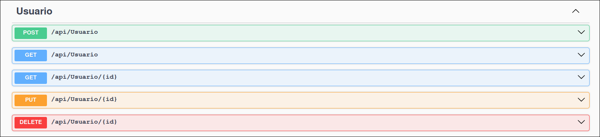
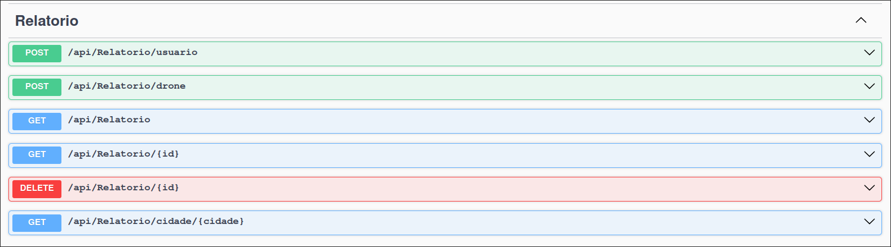

# GS - Protech The Future | .NET

## Integrantes

| Nome                   |   RM   |
| :--------------------- | :----: |
| Otavio Miklos Nogueira | 554513 |
| Luciayla Yumi Kawakami | 557987 |

---

## Links

- Repositório: https://github.com/omininola/gs_dotnet
- Vídeo demonstrativo: 
- Vídeo Pitch: 

---

## Projeto

A solução foi pensada para ser uma forma simples e efetiva de alertar as pessoas sobre incêndios e queimadas em suas regiões, a nossa API tem diversos endpoints que possibilitam a troca de informação entre o banco de dados e as comunidades, já que cada usuário pode relatar algum incêndio ou queimada que avistaram pela própria região, gerando assim um senso de alerta maior, e uma cooperação para a identificação desses problemas.

Além disso, também temos drones equipados com sensores e camêras capazes de identificar esses desastres e alertar também as suas regiões, deixando esse processo mais automático e eficiente.

---

## Inicialização

Clone esse repositório com o comando `git clone https://github.com/omininola/gs_dotnet.git`

### API

1. Entre na pasta do projeto `cd gs_dotnet/NaturalDisasterAPI`
2. Rode a API `dotnet run`
3. Entre no link da aplicação pelo seu browser http://localhost:5087/swagger/index.html

### MVC (Somente referente a tabela de usuários)

1. Entre na pasta do projeto `cd gs_dotnet/NaturalDisasterMVC`
2. Rode o MVC `dotnet run`
3. Entre no link da aplicação pelo seu browser http://localhost:5010/

---

### Exemplos

Nossa API disponibilza diversos endpoints para uma melhor experiência. Os principais deles são /usuario juntamente com /relatorio dessa forma você consegue criar um novo usuário na aplicação e com esse novo usuário, você pode fazer novos relatos de queimadas ou incêndios na sua região

